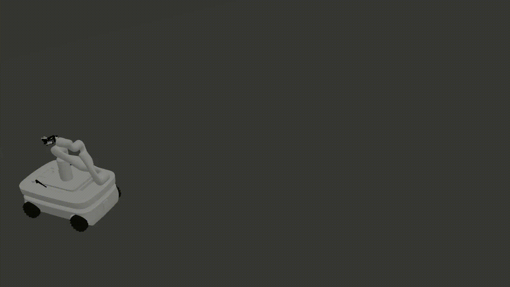

# Move Bot Visualisation

This is a ROS package for visualising the motion-planning and movement of a hybrid robot consisting of a PAL Omni Base, a Kinova Gen3 robotic arm, and a Robotiq 85 gripper.

In this repository, we look at two possible ways to control the robot. The first strategy goes the MoveIt! path. The second strategy goes the path of the ROS Navigation. Both have their advantages and disadvantages which will be discussed in the respective section.

## Prerequisite

- Ubuntu 20.04
- ROS Noetic Ninjemys
- MoveIt! Motion Planning Framework
- Gazebo 11

## Installation

It is assumed that ROS Noetic Ninjemys is installed in the system. If not, please refer to [ROS Wiki](http://wiki.ros.org/noetic/Installation/Ubuntu) for step-by-step installation instructions.

It is also assumed that MoveIt! is installed. If not, run the following bash command:

```bash
sudo apt install ros-noetic-moveit
```

To control the robots in simulation, we need to install the ```ros_control``` and ```ros_controllers``` packages.

```bash
sudo apt install ros-noetic-ros-control ros-noetic-ros-controllers ros-noetic-diff-drive-controller
```

Initialise catkin workspace:

```bash
mkdir -p ~/catkin_ws/src
cd ~/catkin_ws/src
```

This package is all-encompassing, in that it contains all the robot description files you need. So clone this repository into the catkin workspace.

```bash
git clone https://github.com/juniorsundar/move_bot_sim.git
```

Build catkin workspace.

```bash
cd ~/catkin_ws
catkin_make
source devel/setup.bash
```

## Method 1: MoveIt! with Visualisation


*video available [here](./media/move_bot_demo-moveit.mp4)*

For the visualisation in MoveIt!, a URDF file is required that defines the hybrid robot. The ```.xacro``` file can be accessed in [```move_bot.xacro```](./move_bot_description/urdf/move_bot.xacro).

Note that an additional part was modelled to act as the base joining the PAL Omni Base and the Kinova Arm. It was designed using **Blender**, and can be accessed in [```base_bot_platform.stl```](./kinova_gen3_description/meshes/base_bot_platform.stl).

MoveIt! is not optimal to control moving base, since the motion plan is taken with respect to a fixed 'world' TF. However, in order to motion plan for this model through MoveIt! certain steps were taken.

Since the moving base can be defined as a 3DOF system, in the URDF file, three additional dummy links ```x_base```, ```y_base```, and ```z_base```. The dummy 'world' frame is joined to ```x_base``` with a prismatic joint for translation in the x-axis. ```x_base``` is joined to ```y_base``` with a prismatic joint for translation in the y-axis. ```y_base``` is joined to the ```z_base``` with a revolute joint for rotation in the z-axis. This effective defines all the possible movements the base can make. Note, however, that this means the control is being performed on the base as a whole and not through the wheels, i.e. the base is moving as a static object while the wheels aren't rotating.

### Planning Groups

- **base** - Contains the three joints that define the 3DOF moving base.
- **arm** - Contains the seven joints that define the arm's configuration.
- **end_effector** - Contains the finger joint that controls the gripper.

*refer [here](./move_bot_moveit_config/config/move_bot.srdf).*

### Motion Planner Selection

- **base** - We are using *RRTConnect* since the dimensionality of this system is low, and speed and efficiency of plan is important.
- **arm** - We are using *PRMstar* since this has a higher dimensionality. Furthermore, it also considers the optimality of the path, pruning out poor paths if there is a lower cost alternative.
- **end_effector** - No planner required since.

*refer [here](./move_bot_moveit_config/config/ompl_planning.yaml)*

### Execute Visualisation

To replicate the above visualisation, run the following bash command:

```bash
roslaunch move_bot_visualisation move_bot_visualisation.launch
```

The robot's execution is defined in [```move_bot.py```](./move_bot_visualisation/scripts/move_bot.py). The code is extensively documented to explain the exact steps taken to plan the motion and execute it.

## Method 2: ROS Navigation Stack with Simulation


*video available [here](./media/move_bot_demo-move_base.mp4)*

An observation made earlier was that the base's control was being simplified into a 3DOF system. The control is on the static platform rather than the wheels. This method attempts to control the robot base using a differential drive controller and con

In this process, we are sacrificing the motion planning capability gained from MoveIt! since there is no TF from the 'world' frame to the robotic arm's base. However, this problem can also be bypassed by treating the arm and the base as two separate systems, then implementing the ROS Navigation stack on the base and the MoveIt! framework on the arm.

This method is purely implemented as a proof-of-concept, since I believe that controlling the base through the ROS Navigation stack is the right way to go about it. Using Method 1 is still a viable solution, though it limits the workable range of the moving base (as it has to be constrained in the URDF).

This method's implementation is done in a separate sub-package: [```move_bot_gazebo```](./move_bot_gazebo/). Note that the visualisation is through simulation since the controllers are being loaded directly into **Gazebo**.

### Hardware Interface and Controllers

The base uses differential drive controllers for its wheels. This can be seen in a redefined [```omni_base.urdf.xacro```](./move_bot_gazebo/urdf/omni_base.urdf.xacro) in the ```move_bot_gazebo``` sub-package. Control commands are then sent to the ```/cmd_vel``` rostopic.

The robotic arm and gripper are also defined with the ```PositionJointInterface``` hardware controllers. Control commands are then sent to their respective ```/joint{joint_number}_position_controller/command``` rostopic.

The [```ros_controller.yaml```](./move_bot_gazebo/config/ros_controllers.yaml) file defines the exact ROS Controllers used to control the arm and gripper.

### Execute Simulation

To replicate the above simulation, run the following bash command:

```bash
roslaunch move_bot_gazebo move_bot_move_base.launch
```

This also launches the [```move_bot_control.py```](./move_bot_gazebo/scripts/move_bot_control.py) control script which loads the ROS Controllers and publishes control commands for the base, arm and gripper. The code is extensively documented and explains its functions clearly.